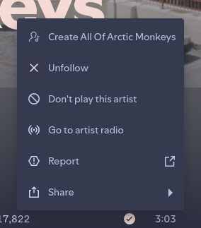
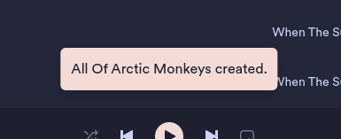
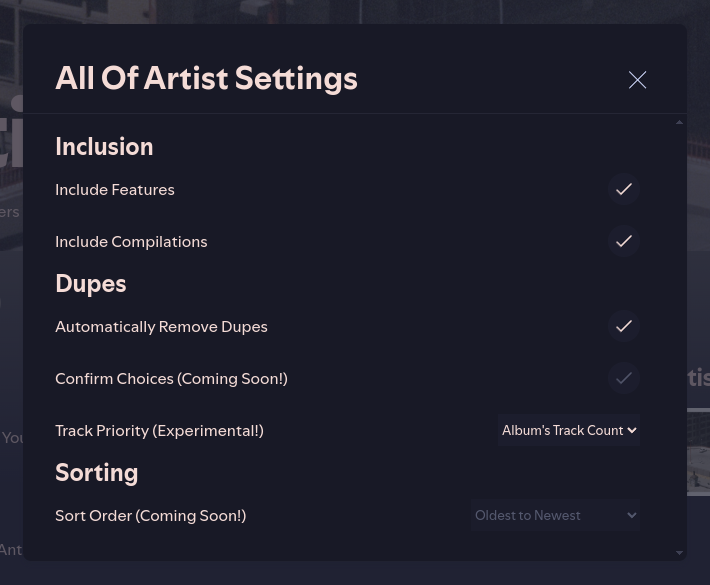

# All Of Artist
[Spicetify](https://github.com/khanhas/spicetify-cli) extension to create a playlist with all the tracks of an artist

## Install
### Through [marketplace](https://github.com/spicetify/spicetify-marketplace)
In Extensions, search for 'All Of Artist' and install it.

### Manually
Copy `allOfArtist.js` into your [Spicetify](https://github.com/khanhas/spicetify-cli) extensions directory:
| **Platform**   | **Path**                                                                             |
|----------------|--------------------------------------------------------------------------------------|
| **Linux**      | `~/.config/spicetify/Extensions` or `$XDG_CONFIG_HOME/.config/spicetify/Extensions/` |
| **MacOS**      | `~/spicetify_data/Extensions` or `$SPICETIFY_CONFIG/Extensions`                      |
| **Windows**    | `%appdata%\spicetify\Extensions\`                                                    |

After putting the extension file into the correct folder, run the following command to install the extension:

```sh
spicetify config extensions allOfArtist.js
spicetify apply
```

Or you can manually edit your `config-xpui.ini` file. Add your desired extension filenames in the extensions key, separated them by the | character:

```ini
[AdditionalOptions]
...
extensions = foo.js|bar.js|allOfArtist.js
```

Then run:

```sh
spicetify apply
```

## Usage
Right click an artist, track or album and you'll have an option to "Create All Of [Artist Name]"

In the profile menu you'll se an item "All Of Artist" where you'll be able to tailor the extension to your needs:
- Inclusion
    - Include Features - Includes tracks from other artists where they're featured on;
    - Include Compilations - Includes tracks from compilations;
- Dupes
    - Automatically Remove Dupes - Removes track dupes, dupes are defined by the "Track Priority" setting;
    - Confirm Choices (work in progress) - Displays a list of all the tracks that'll be added and excluded from the playlist (dupes), allowing you to choose between track versions;
    - Track Priority - Determines which tracks to prioritize when removing dupes;
- Sorting
    - Sort Order (work in progress) - Determines the order in which the tracks will be sorted.

<div>
<br>
<br>

</div>

## More

If you find any bugs, please [create a new issue](https://github.com/Pl4neta/allOfArtist/issues/new) on the GitHub repo.
To better assess the issue please provide:
  - The spicetify's version,
  - All extensions installed besides allOfArtist,
  - And if the issue is related to some specific artists, provide those aswell.

[](https://github.com/Pl4neta/allOfArtist/stargazers)
[](https://github.com/Pl4neta/allOfArtist/issues)
